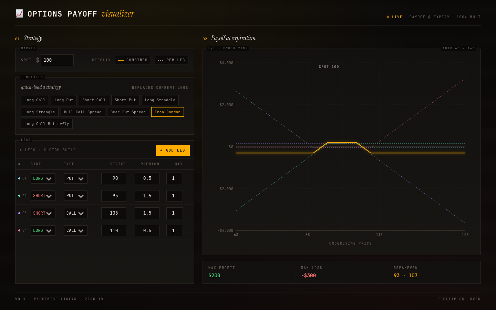

# Options Payoff Visualizer

Stack any number of option legs into a strategy and see the combined payoff at expiration. A single-screen, terminal-styled web app built with React + Vite + TypeScript.



## Features

- **Custom strategy builder** — add legs (long/short × call/put × strike × premium × qty), edit inline, remove individually.
- **Ten preset templates** — long call, long put, short call, short put, straddle, strangle, bull call spread, bear put spread, iron condor, long-call butterfly. Strikes are anchored to the current spot.
- **Independent display toggles** — show/hide the combined payoff line and the per-leg overlays separately.
- **Row-hover focus** — hover a leg row in the editor and the matching curve in the chart goes solid + glowing while the rest fade. Works even with the per-leg toggle off, so hover is always a way to inspect a single leg.
- **Live summary** — max profit, max loss (both detect "Unlimited" via endpoint slope), and breakevens, including a "flat — net zero across range" branch for degenerate strategies (long+short of identical contract).
- **Financial-terminal aesthetic** — amber-on-near-black, JetBrains Mono throughout, Instrument Serif italic accent, CRT scanlines.

## Run

```bash
npm install
npm run dev          # http://localhost:5173
npm run build        # tsc -b && vite build
```

Type-check only: `npx tsc -b`. There are no tests, no linter.

## Project layout

```
src/
├── App.tsx                       # holds all state (legs, spot, toggles, hovered leg)
├── components/
│   ├── LegEditor.tsx             # market panel · template chips · legs table
│   └── PayoffChart.tsx           # Recharts LineChart, hover-aware styling
└── lib/
    ├── payoff.ts                 # pure math (legPayoff, samplePayoff, summary)
    ├── presets.ts                # spot → Leg[] factories per strategy
    ├── legColors.ts              # cool-only palette (amber is reserved for combined)
    └── types.ts                  # Leg, Side, Kind, CONTRACT_MULTIPLIER
```

## Math conventions

- Per-leg payoff is per single contract; the **100× contract multiplier is applied once** at the strategy level (`strategyPayoff`, `samplePayoff`), never inside `legPayoff`.
- The sample x-set explicitly includes every leg's strike so the piecewise-linear kinks render crisply.
- `Breakeven = number | { from, to }` — flat-zero intervals collapse into a single range rather than flooding the chart with hundreds of point breakevens.
- `summary().flat = true` short-circuits degenerate strategies (e.g. long + short of the same contract) into "Flat — net zero across range".

## Out of scope

Black-Scholes pricing, Greeks, time-decay curves, per-leg expirations, underlying-shares leg, persistence (URL/localStorage), import/export.

## Contributing

Architectural conventions, design tokens, and gotchas to respect when extending the codebase live in [`CLAUDE.md`](CLAUDE.md).
